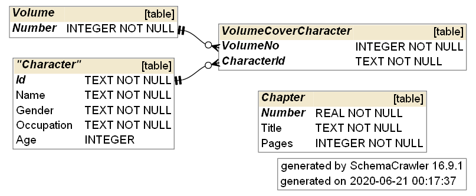

# kaguya-sama-sqlite3
A SQLite3 database on the Kaguya-sama: Love is War manga that I update during my free time for fun

Updated to: Chapter 0

Files
---

* kaguya_data.db:  SQLite3 file containing currently stored information on the manga series.
* kaguya_data.sqbpro: [DB Browser for SQLite](https://sqlitebrowser.org/) project file
* schema.pdf: Diagram of the database schema
* gen_diagram_helper.cmd: Helper windows command script to generate schema.pdf using SchemaCrawler

Tools used
---
* [DB Browser for SQLite](https://sqlitebrowser.org/)
* [SchemaCrawler](https://www.schemacrawler.com/diagramming.html) for diagramming the schema

Schema
---

### Series
Name of the series e.g. "Main" or "4koma". For succinctness the names used is unlikely to tally with the full name of the actual series. Official Doujin is not part of the dataset as it is not canon.

### Volume
The volume number is also recorded. For series without volume numbering (or without recorded volume numbering due to translation lag e.g. 4koma), the volume number is just 1 by default.

### Arc
Name of the arc to keep track of what events, actions or opinions were formed during the arc. Arcs span across chapters. If the arc doesn't have a name, an unofficial name will be used in its stead. An auto-incremented Id is used instead of the name as not all arcs may be given an official name.

### Chapter
Information on a chapter. Note that the number is a real number to account for side-chapters. Information on chapter revisions are uusually omitted, or directly replace existing information to avoid causing misleading aggregate information.

### Topic / Item
Entity tables to keep track of what were discussed, used or interacted with. A topic represents an idea, concept or activity that does not necessarily take physical form (e.g. Tsubasa's hair). An item represents an object (e.g. the school building). The description field may be used to describe the item, or to describe its significance etc.

### VolumeCoverCharacter
Character(s) that appeared on the volume cover.

### Character
Characters in the manga. Note that the narrator is also a character in this dataset so that his opinions may be recorded.
* While the narrator's words may represent the absolute truth, they cannot be taken as fact due to character developments, hidden character knowledge or chaos theory.

### Opinion
Contains information on a character's opinion on a character, topic or item.

### Action
Contains information on something a character performed (as an action) to a character or item.

### Event
Contains information on something that happened (not performed by a character) to a character or an item.

### Other notes
Speculation or random theories are omitted from the dataset; only confirmed facts / opinions mentioned in the manga is recorded. However, if a particular item / action has some unstated significance, this may be brought up in the dataset.

Considerations
---
### Why SQLite
Storing the data in a relational database seemed like a good idea to ensure the data remains structured.

### Why multiple foreign keys in Opinion, Action & Event
The entities may not be mutually exclusive in the case of an Opinion (e.g. Miyuki having an opinion about Kaguya on exams),  but for Action & Event it is simply due to implementation limitations (e.g. sqlite's lack of support to implement subclass tables and/or my lack of knowledge in its sqlite's ability to do so). This design should adequately serves the same purpose without significant design or performance issues.