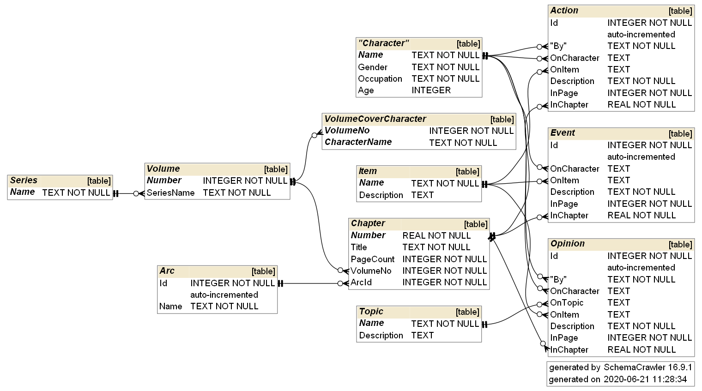

# kaguya-sama-sqlite3
A SQLite3 database on the Kaguya-sama: Love is War manga that I update during my free time for fun

Updated to: Chapter 0 (Incomplete Schema)

Files
---

* kaguya_data.db:  SQLite3 file containing currently stored information on the manga series.
* kaguya_data.sqbpro: [DB Browser for SQLite](https://sqlitebrowser.org/) project file
* schema.pdf: Diagram of the database schema
* gen_diagram_helper.cmd: Helper windows command script to generate schema.pdf using SchemaCrawler

Tools used
---
* [DB Browser for SQLite](https://sqlitebrowser.org/)
* [SchemaCrawler](https://www.schemacrawler.com/diagramming.html) for diagramming the schema

Schema
---

